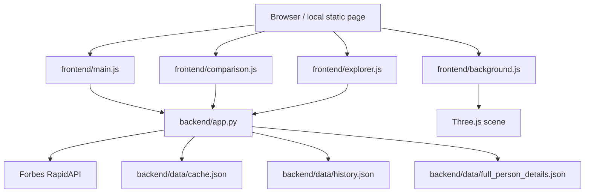

# Real-Time Wealth Inequality

Written by Ben Cerbin.

An interactive browser app that turns billionaire wealth data into a live visualization and exploration tool.

The project combines:
- a Flask backend that fetches and caches billionaire data
- a static frontend with animated counters and a Three.js comparison scene
- a searchable billionaire explorer with a facts card
- a small system test suite that checks the most important flows end to end

This README is meant to be understandable for a strong undergraduate computer science student who wants to know how the app works without reading every line of code first.

## What The App Shows

The page has four main parts:

1. The hero section at the top
   - Shows how much wealth billionaire estimates have gained since the page opened
   - Shows how much they gained over the past year

2. The 3D comparison section
   - Uses planets to compare billionaire wealth against other reference groups
   - Supports toggling reference planets on and off
   - Lets you search for a billionaire and add them as an extra planet

3. The billionaire explorer
   - Lists billionaire profiles
   - Lets you filter by search text, industry, state or country, and wealth range
   - Lets you sort by wealth, name, industry, residence, or scores
   - Shows a facts card for the selected billionaire

4. The backend API
   - Serves live or cached billionaire totals
   - Serves normalized profile data for the explorer
   - Uses local cache files so the app still works when the upstream API is slow or failing

## High-Level Architecture



The important idea is that the browser is not talking directly to the Forbes API. It talks to the local Flask app, and the Flask app handles caching and data cleanup.

## Repository Map

- [`backend/app.py`](./backend/app.py)
  - Main Flask application
  - Provides the API routes and serves the frontend

- [`backend/services/fetchbillionaires.py`](./backend/services/fetchbillionaires.py)
  - Makes the live request to the RapidAPI Forbes endpoint
  - Converts the raw API payload into a smaller internal format

- [`backend/services/fetchdetail.py`](./backend/services/fetchdetail.py)
  - Helper for fetching a single billionaire detail record from RapidAPI

- [`backend/data/cache.json`](./backend/data/cache.json)
  - Versioned cached snapshot for the summary billionaire endpoint

- [`backend/data/full_person_details.json`](./backend/data/full_person_details.json)
  - Local dataset used by the explorer

- [`backend/data/history.json`](./backend/data/history.json)
  - Historical wealth values used to calculate year-over-year change

- [`frontend/index.html`](./frontend/index.html)
  - Page layout and script includes

- [`frontend/main.js`](./frontend/main.js)
  - Hero counters and reveal animation

- [`frontend/background.js`](./frontend/background.js)
  - Full-screen starfield and drifting planet background

- [`frontend/comparison.js`](./frontend/comparison.js)
  - Three.js comparison scene and lookup planet flow

- [`frontend/explorer.js`](./frontend/explorer.js)
  - Filterable billionaire list and facts card

- [`frontend/style.css`](./frontend/style.css)
  - Shared styling for the whole app

- [`tests/test_system_integration.py`](./tests/test_system_integration.py)
  - System-level integration tests for the backend and frontend wiring

## How The Data Flows

### 1. The browser loads the frontend

The browser renders `frontend/index.html`, which loads:
- `main.js`
- `background.js`
- `comparison.js`
- `explorer.js`
- Three.js from a CDN

### 2. The frontend fetches data from the local Flask app

The JavaScript looks for the API at local addresses such as:
- `http://127.0.0.1:5001`
- `http://127.0.0.1:5000`

The app was built this way because local static preview servers, like `127.0.0.1:5501`, can serve HTML and JavaScript but cannot answer the `/api/...` routes themselves.

### 3. The Flask app serves cached data or live data

The Flask app does this for the summary route:

1. Check whether `backend/data/cache.json` exists
2. If the cache is fresh enough, return it immediately
3. Otherwise, call the live Forbes RapidAPI endpoint
4. Merge in history data from `backend/data/history.json`
5. Save the refreshed response back to `cache.json`
6. Return the new data to the browser

That means the app is resilient to short-term failures in the upstream data source.

## Backend Design

### `GET /api/billionaires`

This is the summary endpoint used by the hero counters and the comparison scene.

The route:
- fetches live billionaire data
- adds `last_year_wealth` when history data is available
- stores the result in a versioned cache
- falls back to the cached copy if the live request fails

Typical fields include:
- `id`
- `name`
- `wealth`
- `rank`
- `delta`
- `country`
- `last_year_wealth`

This route is the main reason the app can feel "real time" without hammering the live API on every request.

### `GET /api/billionaires/details`

This route serves the explorer data.

It reads the local normalized dataset from `backend/data/full_person_details.json` and converts each raw person record into a cleaner shape for the UI.

The explorer uses fields like:
- `id`
- `name`
- `image`
- `wealth`
- `residence`
- `state`
- `country`
- `industry`
- `philanthropy_score`
- `self_made_score`
- `quote`
- `about`

### `GET /api/billionaires/details/search`

This currently returns the same normalized detail dataset as `/api/billionaires/details`.

The frontend uses that dataset to implement the actual search and filtering behavior locally. In other words, the route exists as the data source for search, but the filtering itself happens in the browser.

### `normalize_explorer_person`

This helper is important because it turns messy raw data into a consistent format the frontend can use.

It does a few things:
- parses the residence into a full residence string, state, and country
- extracts the source of wealth as an industry label
- converts philanthropy and self-made scores into numbers
- preserves the person quote and extra descriptive text

That normalization step is why the frontend can treat all records the same way, even if the raw source data is inconsistent.

## Frontend Design

## `main.js`

This file drives the hero counters at the top of the page.

What it does:
- fetches billionaire summary data from the API
- adds up the daily wealth change
- adds up the year-over-year wealth change
- animates the numbers using `requestAnimationFrame`
- adjusts the opacity of the scroll cue and the reveal text as the user scrolls

The key idea is that the numbers are not static. The page keeps animating them from the moment it loads.

## `background.js`

This file creates the full-screen space background using Three.js.

It:
- creates a starfield
- adds lighting
- loads a textured planet
- slowly moves the camera forward
- rotates the planet over time

This section is intentionally decorative. It gives the page motion and depth before the comparison scene appears.

## `comparison.js`

This is the 3D wealth comparison scene.

The scene has several reference planets, including:
- billionaire wealth
- bottom 50 percent wealth
- a smaller sample reference
- a lookup billionaire planet that can be added from the search panel

### Why the planets use scaling

The app uses cube-root scaling for planet size.

That matters because:
- wealth is being represented by a 3D sphere
- the perceived size of a sphere depends on radius, but the amount of stuff it contains depends on volume
- volume grows roughly with the cube of the radius

So if one person has 8 times as much wealth as another, the planet does not become 8 times wider. Instead, the radius grows by the cube root of the ratio. This keeps the comparison visually meaningful instead of absurdly large.

### Lookup billionaire flow

The lookup panel works in two steps:

1. Click a result card to choose a billionaire candidate
2. Press `Add planet` to place that billionaire into the comparison scene

This matters because a click should not instantly commit the selection. The UI first lets you inspect the candidate and then explicitly add them.

When a lookup billionaire is added:
- the scene creates a fourth planet
- the camera zooms out enough to keep the scene framed
- the readout includes the lookup comparison
- the planet can be removed again with `Remove planet`

### What the comparison scene is good for

The comparison view answers questions like:
- How does billionaire wealth compare to the bottom half of Americans?
- How much larger is one billionaire relative to a sample population?
- What happens when a specific billionaire is added into the same scene?

It is a visualization, not a statistical proof, but it is useful for building intuition.

## `explorer.js`

This file powers the searchable billionaire list and the facts card.

The explorer lets you filter by:
- text search
- industry
- state or country
- minimum wealth
- maximum wealth
- sort field
- ascending or descending order

The facts card shows:
- name
- residence
- wealth
- industry
- philanthropy score
- self-made score
- quote
- an estimate of how many years it would take an average American earning $67,000 per year to earn the same wealth

### Years to earn the wealth

That last number is calculated as:

`years = billionaire_wealth_in_dollars / 67000`

This is a simple but powerful way to reframe a huge wealth number into a human-scale comparison.

### Why the explorer is client-side

The explorer pulls the full normalized dataset once and then filters in the browser.

That makes the interaction feel fast because typing into search or changing a filter does not require a new API call every time.

## Styling And UI

The app uses a dark visual language with glowing orange accents.

The design choices are intentional:
- the hero counters use oversized display typography
- the comparison scene feels like a stylized space exhibit
- the explorer cards use glassy panels and clear hierarchy
- the facts card emphasizes the selected billionaire with large type and compact stat blocks

The CSS lives in [`frontend/style.css`](./frontend/style.css).

## Running The Project Locally

### Prerequisites

- Python 3
- A browser
- Network access if you want the live Forbes data fetch to work

### Start the backend

From the repository root:

```bash
python backend/app.py
```

By default Flask runs on `http://127.0.0.1:5000/`.

### Open the frontend

You can use one of these:
- the Flask-served page at `http://127.0.0.1:5000/`
- the local static page at `http://127.0.0.1:5501/frontend/index.html`
- the HTML file directly in a browser, if your browser allows local file access

The frontend scripts know how to look for the local Flask API on `5001` or `5000`.

## Testing

The repo includes a system-level test suite:

```bash
python -m unittest tests.test_system_integration -v
```

The tests verify:
- cached billionaire summary data is served without calling the live fetch path
- live summary responses are merged with history and written back to cache
- detail records are normalized correctly
- the frontend HTML includes the expected wiring for the lookup panel and years-to-earn block

These tests are intentionally focused on system behavior rather than tiny implementation details.

## Common Pitfalls

### The page loads but the counters or explorer do not

That usually means the frontend could not reach the Flask API.

Check that:
- `python backend/app.py` is running
- the frontend is trying the correct local port
- the browser is allowed to make local fetch requests

### The data looks stale

That usually means the summary cache is still fresh.

The cache is versioned and time-based, so the app will reuse it for a while before refreshing it from the live API.

### The lookup billionaire appears tiny or missing

That means the scene framing or the wealth scaling is off.

The lookup flow intentionally converts the selected billionaire into the same unit system the comparison scene uses before scaling the planet.

## If You Want To Extend The App

Good next changes would be:
- moving the search filtering into the backend if you want server-side filtering
- adding a browser smoke test for the 3D comparison scene
- improving industry normalization so near-duplicate categories collapse into broader groups
- adding more explanation overlays for viewers who are new to inequality visualizations

## Short Version

If you only remember one thing, remember this:

- the Flask app is the data layer
- the frontend is the visualization layer
- the cache makes the app resilient when the live API is flaky
- the explorer filters data in the browser for speed
- the 3D scene uses proportional scaling to turn wealth into a visual comparison

Documentation and implementation notes in this README are by Ben Cerbin.
